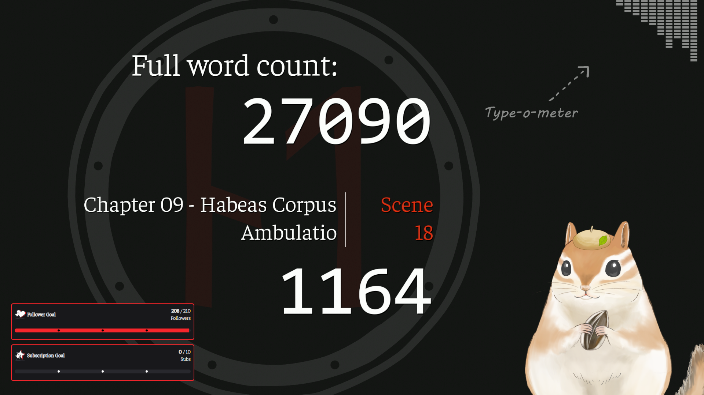
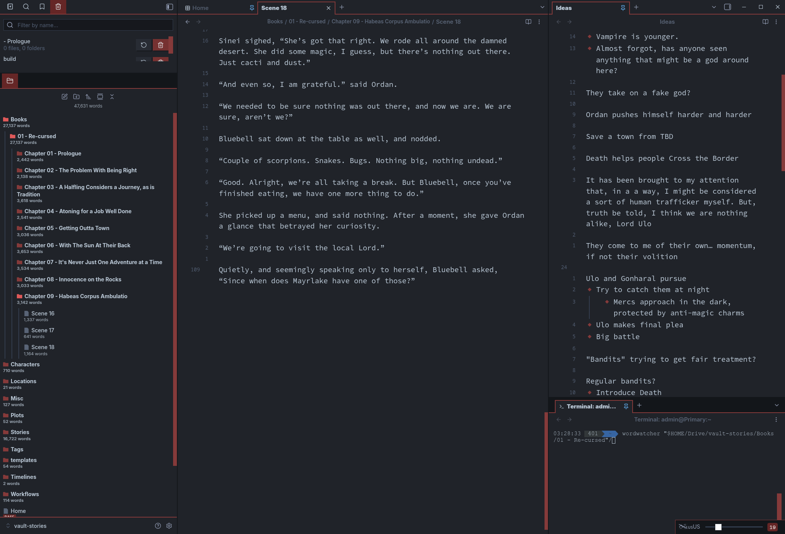
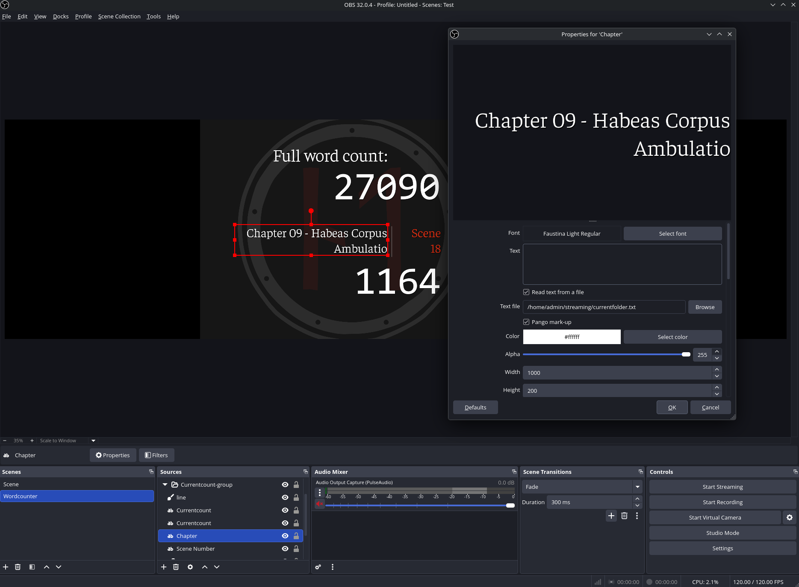

# wordcount-for-streamers
_An easy* way to display the word count of your writing projects live on stream._

\* For given values of "easy."



See it in action [on Youtube](https://www.youtube.com/watch?v=uOplUFc2LMA).

## What's this for?

Have you ever been writing a book, and wanted to show your live word count on stream in a big fancy way? No? I'm the only one?

That figures.

Well regardless, this sure is one way to do it.

## Features
* Count the words in your the most recently-edited markdown file in your book's folder live, and write that number to a file every time it changes.
* Count ALL the words in all the markdown files in your book's folder, write the number to a file, etc.
* The script can also capture and log the name of the current file you're working on as well as what sub-folder it happens to be in, if any.
* All this data gets written to separate text files, which can then be used as text sources in OBS.

## Prerequisites and dependencies
* Some familiarity with the command line.
* Linux
    * You could probably get this to work on Windows via WSL, but I won't be testing that any time soon.
* Python
    * And the pipx package installer, see your distro's documentation for installation instructions.
    * The markdown-word-count package, installed via pipx for convenience
* A folder full of markdown files, subfolders full of markdown files, or both.
    * Yes, this was specifically designed for use with markdown.
    * I'm using Obsidian as my editor, but any text editor will do.
* A desire to actually be this goddamned nerdy.

## Instructions for relative Linux newbs

Alright, so get your dependencies in order first. Most of this script is plain old bash and GNU utilities, so it should be compatible with most Linux distros and even WSL.

### Step 1 - Install [markdown-word-count](https://pypi.org/project/markdown-word-count/)

Make sure you have a recent version of Python 3 on your system, and the pipx package installer. Yes, you could probably do this with regular pip, but I prefer to have access to this utility system-wide. Once you have pipx up and running, just run this command:

```bash
pipx install markdown-word-count
```
Note: early drafts of my scripts used `wc -w` to count the words, but that only ends up counting bits of Markdown syntax like `##` and `---` as words, hence the need for the Python package.

### Step 2 - Get the scripts

Either clone this repository, or just download the files zipped. Grap `wordcount` and `wordwatcher` because you'll need both.

### Step 3 - Get the scripts ready to run

You can do the following in any order, really:

#### Make the scripts executable

Run `chmod +x wordcount` and `chmod +x wordwatcher`, or use the Properties dialogue in your favorite file browser to mark them as executable.

#### Place the scripts in your PATH
This is soo you can run the scripts from anywhere by just typing `wordwatcher /your/book/folder/here`.

I accomplish this by having a dedicated folder for my own scripts in my home folder. So, if your home folder is located at `/home/yourusername/`, you could create a folder called `scripts` in your home folder, and put the two files you downloaded in there. 

Then, open your .bashrc file (located at `/home/yourusername/.bashrc`) and add this... pretty much wherever you like, though I prefer to have it at the bottom:

```
PATH=$PATH:$HOME/scripts
```

Then run `source $HOME/.bashrc` in your terminal to update the configuration.

### Step 4 - Prepare your folders

So first, you need to make a folder called `streaming` in your home folder, e.g. `/home/yourusername/streaming`. When you run the scripts, the text files that you'll be using for the stream will be created in that folder.

Then you need to prep your book folder. If you're writing your book in Markdown like I am, you're probably way ahead of me. If you're not, here's the deal: these scripts were designed to be used inside a folder full of markdown files. Now, it could just be a folder and chapter files, like so:

```
Yourbook
 - Chapter 1.md
 - Chapter 2.md
 - etc.md
```

Or you can use subfolders like this:

```
Yourbook
 - Chapter 1
  - Scene 1.md
  - Scene 2.md
 - Chapter 2
  - Scene 3.md
  - Scene 4.md
```

Once you have everything organized, you're ready to start.

**Warning:** If you use sub-sub folders with markdown files inside of those, this script may fail entirely. Empty sub-folders may also cause it to fail. I'll see if I can whip up a fix for that at a later date. 

### Step 5 - Run the scripts

You can do this in two ways:

1. Navigate to your book folder in a terminal, and run `wordwatcher` on its own. Just like that.
2. Run the script from any folder you like, so long as you point it to the book folder, like so: `wordwatcher /full/path/to/your/book/`

At this point, the text files mentioned above will be created in your `$HOME/streaming` folder. Remember to leave the terminal window open, or the script will stop updating your word count as you type.

Side note: I use the Terminal plugin for Obsidian so I can just run the scripts from my editor, like so.



### Step 6 - Set up your streaming scene

With OBS, it's pretty simple. Just add text sources to your scene, go right click on them, and set them to display text from your files in the streaming folder.

* currentcount.txt will contain the word count of whichever file in your book folder you edited last.
* fullcount.txt will contain the word count for the entire book folder (well, all the words in markdown files).
* currentfile.txt will show the name of the last file you edited in your book folder.
* currentfolder.txt will show the name of the subfolder your last edited file is in, if any.

Just add those text files to your scene, style the text however you want, place it wherever you want. As long as the script is running in a terminal, your word count and other file information will update live.



### Step 7 - Go live!

Get cracking and have some fun writing on stream, and watch the number go up.

Here are a couple of extra things you might want to check out:
1. In my OBS setup, I use the [Pthread text](https://obsproject.com/forum/resources/pthread-text.1287/) plugin for OBS to replace the default Freetype text source you're stuck with on Linux. It enables some simple text animations when the file changes, so that's awesome.
2. To get the typing sounds, I use the [Click Clack](https://github.com/Acylation/obsidian-click-clack) plugin for Obsidian, and the [Waveform]([url](https://obsproject.com/forum/resources/waveform.1423/)) plugin for OBS to give a visual representation of my typing (see the upper-right) corner in the screenshot or video.

But most of all, have some fun with it!
